<p align="center">
  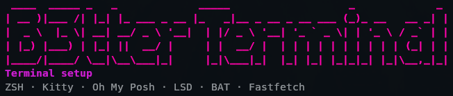
</p>

B3tterTerminal is an interactive custom Kali terminal installer that improves the visual terminal setup with ZSH, Kitty, Oh My Posh, LSD, BAT and Fastfetch.

The installer asks for all options first and only changes the system after the final confirmation.

Built for Kali Linux users who want a better hacking terminal, custom terminal appearance, cleaner command output and a faster post-install terminal setup.

## Preview

<p align="center">
  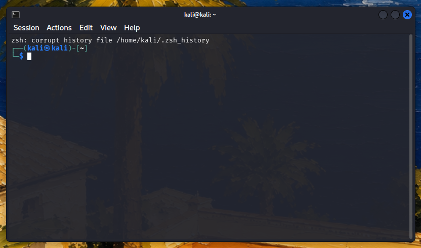
  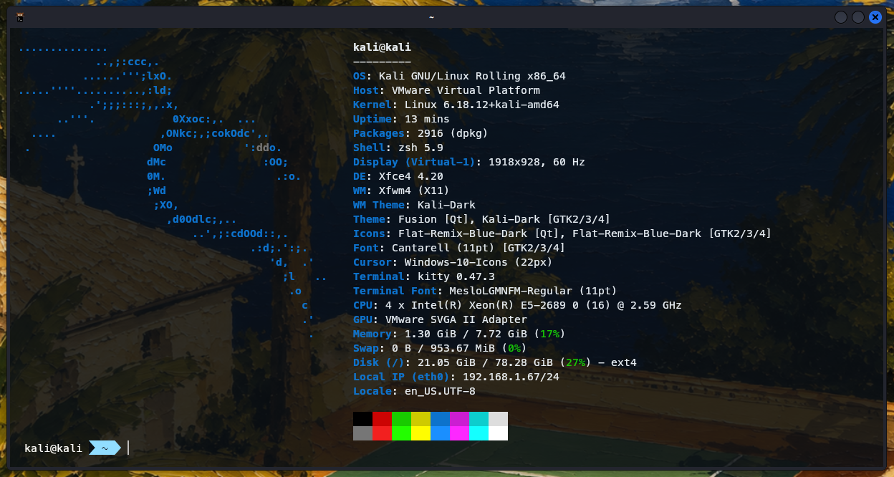
</p>

<p align="center">
  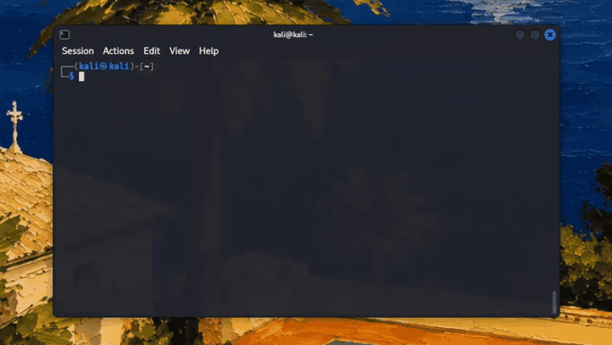
  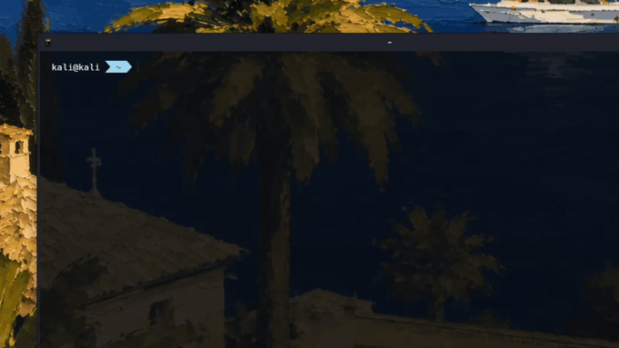
</p>

## Command Upgrades

### ls (lsd)

| Standard `ls` | `ls` with LSD |
| --- | --- |
| 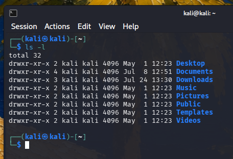 | 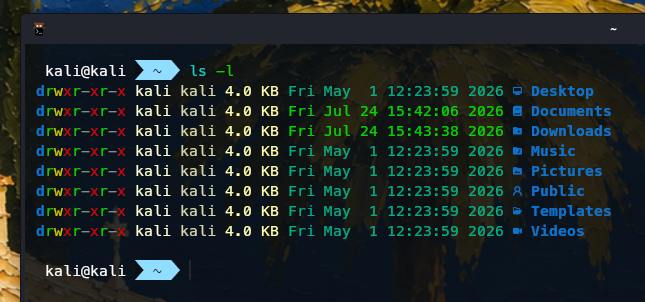 |

### cat (bat)

| Standard `cat` | `cat` with BAT |
| --- | --- |
| 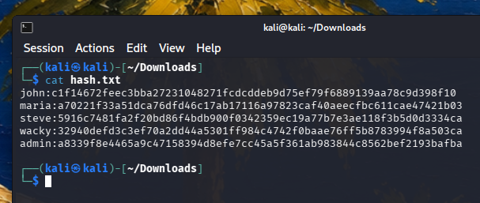 | 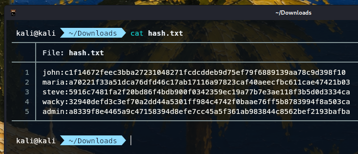 |

## Window Shortcuts

<p align="center">
  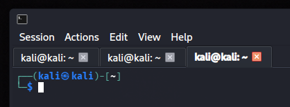
  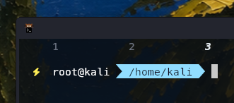
</p>

- `Ctrl+Shift+T` opens a new tab/window.
- `Ctrl+Shift+W` closes the current tab/window.

## Videos

- [Full installation demo](assets/videos/install-demo.mp4)

## Configuration Editor

<p align="center">
  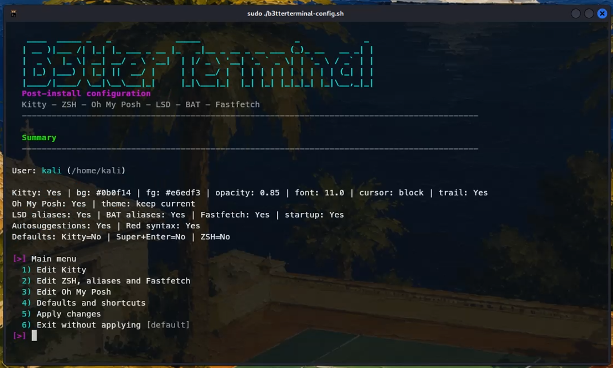
</p>

After installing, `b3tterterminal-config.sh` lets you edit the generated Kali terminal setup without manually touching dotfiles.

## Features

- ZSH setup with optional autosuggestions and syntax highlighting.
- Kitty configuration with palettes, opacity, tabs and optional cursor trail.
- Oh My Posh prompt with selectable theme and optional Meslo Nerd Font.
- LSD aliases for a nicer `ls`.
- BAT aliases for a nicer `cat`.
- Optional Fastfetch startup.
- User-aware setup: packages are installed as root, personal config is applied to the selected user.
- Post-install configuration editor for changing the generated setup without manually editing dotfiles.

## Usage

From a normal Kali user:

```bash
chmod +x b3tterterminal.sh
sudo ./b3tterterminal.sh
```

Install for root from a root shell:

```bash
B3TTER_USER=root ./b3tterterminal.sh
```

Install for root from a normal user:

```bash
sudo B3TTER_USER=root ./b3tterterminal.sh
```

Disable the animated ASCII header if the terminal feels slow:

```bash
sudo B3TTER_ASCII_ANIMATION=no ./b3tterterminal.sh
```

## Configure After Install

Edit the generated setup for your current user:

```bash
chmod +x b3tterterminal-config.sh
./b3tterterminal-config.sh
```

The configuration tool lets you choose English or Spanish at startup. You can also force the language:

```bash
B3TTER_LANG=en ./b3tterterminal-config.sh
B3TTER_LANG=es ./b3tterterminal-config.sh
```

Edit the generated setup for root:

```bash
sudo B3TTER_USER=root ./b3tterterminal-config.sh
```

Force the language when editing root:

```bash
sudo B3TTER_LANG=en B3TTER_USER=root ./b3tterterminal-config.sh
sudo B3TTER_LANG=es B3TTER_USER=root ./b3tterterminal-config.sh
```

The configuration tool can change Kitty colors, opacity, font size, cursor style, cursor trail, Oh My Posh theme, LSD/BAT aliases, Fastfetch startup, ZSH autosuggestions, syntax highlighting, default shell and desktop shortcuts.

## What It Changes

- Installs selected packages with `apt-get`.
- Writes a managed block in the target user's `.zshrc`.
- Creates Kitty config under `~/.config/kitty`.
- Optionally changes the default shell to ZSH.
- Optionally sets Kitty as the default terminal emulator.
- Optionally writes XFCE settings for compositing and `Super+Enter`.

Existing `.zshrc` and Kitty helper files are backed up before changes.

## Roadmap

- Configuration profiles for saving and switching between multiple terminal styles.
- Restore/repair menu for rolling back backups or regenerating the managed terminal setup.

## Notes

The script downloads Oh My Posh, prompt themes and Meslo Nerd Font from their official upstream locations. Review the script before running it if you want to audit every network action.

Search keywords: Kali terminal, custom terminal, Kali hacking terminal, Kali better terminal, custom Kali, custom Kali terminal, Linux terminal customization.

## License

No license has been selected yet. Add a license before publishing if you want other people to know how they may use or modify the project.

## Credits

B3tterTerminal builds on these projects:

- [ZSH](https://www.zsh.org/)
- [zsh-autosuggestions](https://github.com/zsh-users/zsh-autosuggestions)
- [zsh-syntax-highlighting](https://github.com/zsh-users/zsh-syntax-highlighting)
- [Kitty](https://sw.kovidgoyal.net/kitty/)
- [Oh My Posh](https://ohmyposh.dev/)
- [LSD](https://github.com/lsd-rs/lsd)
- [BAT](https://github.com/sharkdp/bat)
- [Fastfetch](https://github.com/fastfetch-cli/fastfetch)
- [Nerd Fonts](https://www.nerdfonts.com/)
